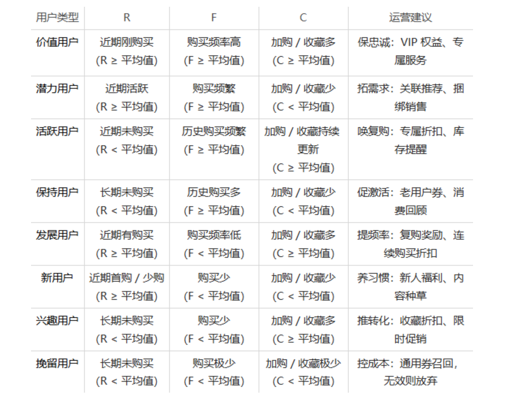

* 数据可视化分析报告
1. 用户流量
- 数据从11月25日至12月3日，共9天
- 根据图表可知：工作日用户流量较为稳定，周末用户流量较工作日有所提升，表明用户需求时间段更多是在周末。
- 12月2日至3日用户流量和独立访客数较前一周有显著提升，可能受到平台“双十二”活动影响。
- 浏览深度在12月2日这一天有所下降，可能是由于当天有更多的独立访客访问了平台，稀释了浏览深度。

2. 用户留存率
- 单日留存率在12月1日、12月2日显著上升，三日留存率在11月29日和30日明显上扬，二者趋势相同，经过分析可能有以下核心因素影响：
    1. 周末用户闲暇时间充裕，购物需求得到充分释放，浏览店铺后留存率自然上升。
    2. 受到“双十二”活动吸引，用户受到优惠、折扣等影响，留存率上升。

3. 用户行为
- 从趋势图上分析，用户行为大体趋势相同，均聚焦在17-21点下班时间，表明用户购物需求集中在下班后，此时用户有更多时间浏览店铺，购物需求得到满足，运营可针对此时间段进行运营活动。
- 12月2日和3日用户购买行为显著提升，可能受到“双十二”活动影响。

4. 用户购买路径
- 排除仅浏览的用户（浏览-/-/-/），绝大部分用户的购买路径停留在购买-收藏界面（总计占比67%），继续后续购买路径的用户占比为12%，表明用户在收藏到购买商品的转化过程中存在用户流失情况。

5. 转化漏斗模型
- 12月2日至3日受到“双十二”活动影响，用户浏览量显著提升，但是从浏览-购买的的转化率较前前一周有所下降，“双十二”活动吸引大量用户浏览后或因为流量质量（周末闲逛用户多、优惠活动未达标）、运营承接（折扣计算复杂）等因素，运营需要重点关注用户转化率问题，提高用户购买转化率。

6. 用户画像

- 用户占比中，新用户、潜力用户和挽留用户构成用户主体，总共占比62%，其中挽留用户占比23%，可以考虑对其进行召回活动。
- 新用户可能首次在平台上购物，运营可针对新用户进行引导，提高用户购买转化率。
- 潜力用户购买力度与频率较高，但是收藏商品频率较低，可能平台未推送适合用户需求商品，可考虑优化商品推荐算法。
- 价值用户因购买意愿与购买力达标，平台可以对其提供专属服务和VIP权益，保持其对平台的忠诚度。
- 活跃用户可能因为当下购买力不足导致长期未购买商品，运营可对其提供专属折扣活动，并推送其心仪商品的库存提醒。
- 保持用户曾在平台上频繁的购买过商品，但近期未登录平坦浏览商品，运营可考虑对其展开老用户回归活动，提供老用户专属折扣。
- 发展用户购买频率较低，平台可对其展开连续购买折上折活动，吸引用户进行连续复购。
- 兴趣用户长期大量收藏商品，需要推送其购买的转化率，可以通过限时促销以及收藏商品时折扣等方式提高用户的购买转化率

7. 热门品类&热卖商品
- 因数据集仅提供品类Id和商品Id，无法获取具体品类名称和商品名称，故无法展示具体品类和热卖商品。

9. 品类销量-决策时间关系
- 观平均浏览-购买和销量的整体趋势，整体呈现负相关，表明除了最受欢迎的商品品类消费者有强烈的购买意愿外，其他品类消费者购买意愿较低，可能是购买流程过程，运营可尝试简化购买流程。

10. 品类流量
- Top3的商品流量与用户在线高峰期基本一致，验证时段运营的普适性。
- 4145813的商品浏览量呈现断层领先，但是购买量却未与其他商品拉开差距，表明其商品转化能力不足，需要优先排查。